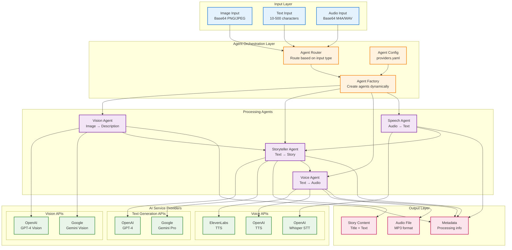
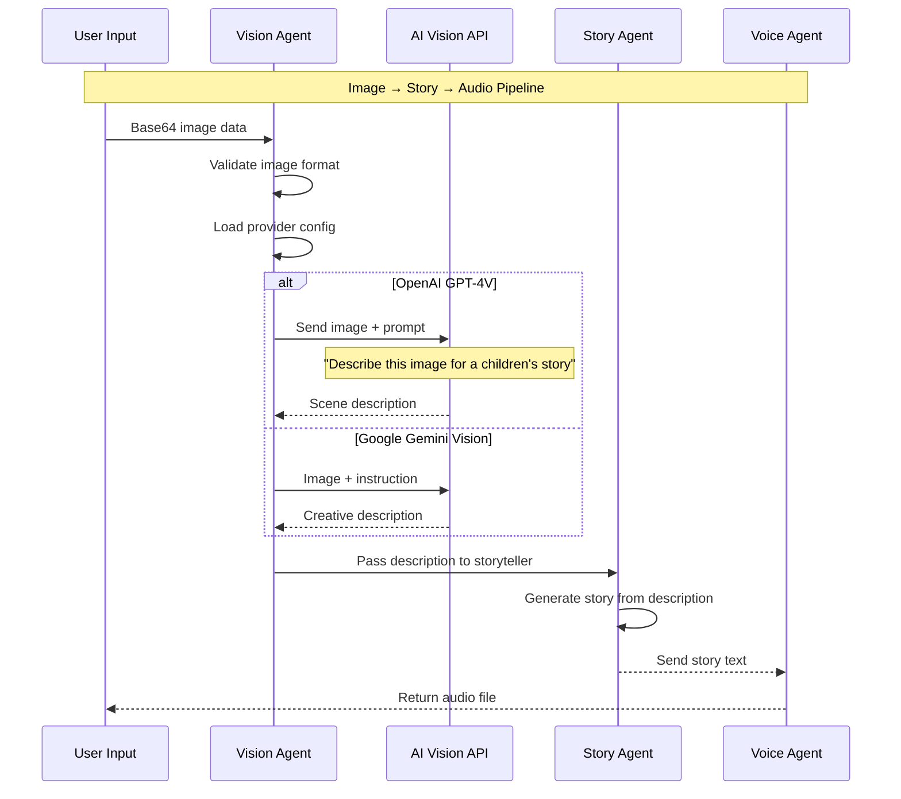
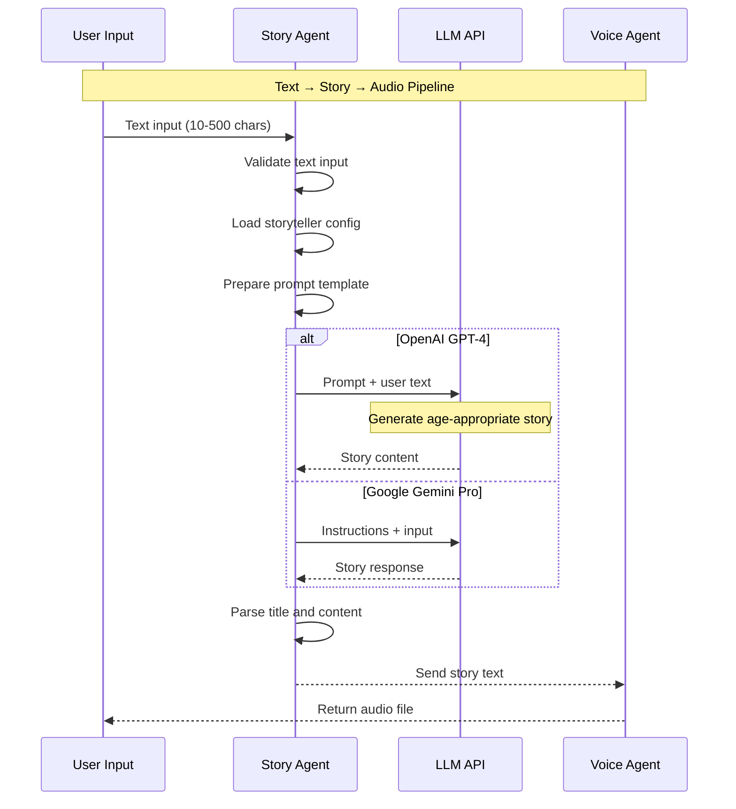
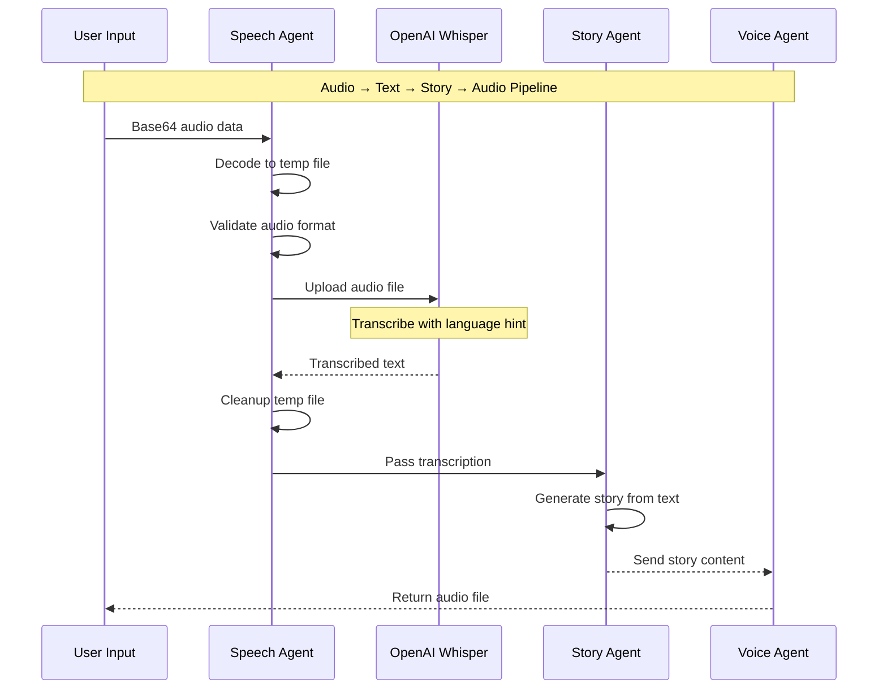
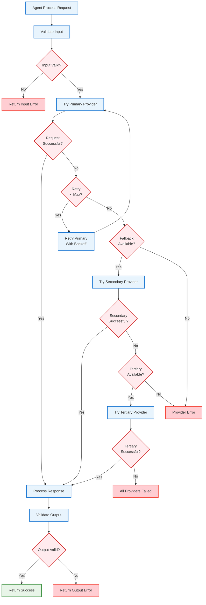
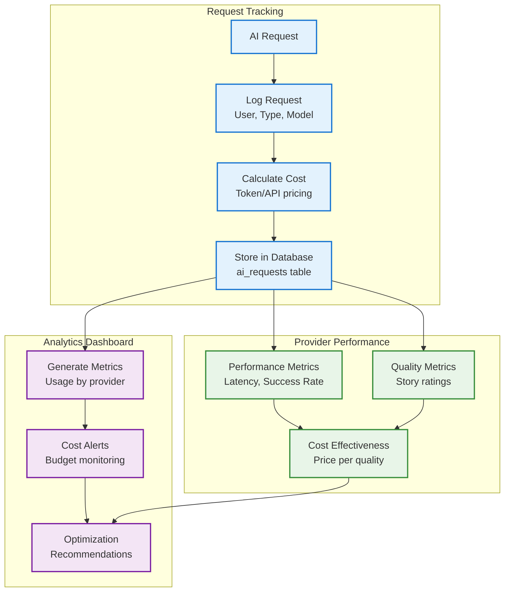
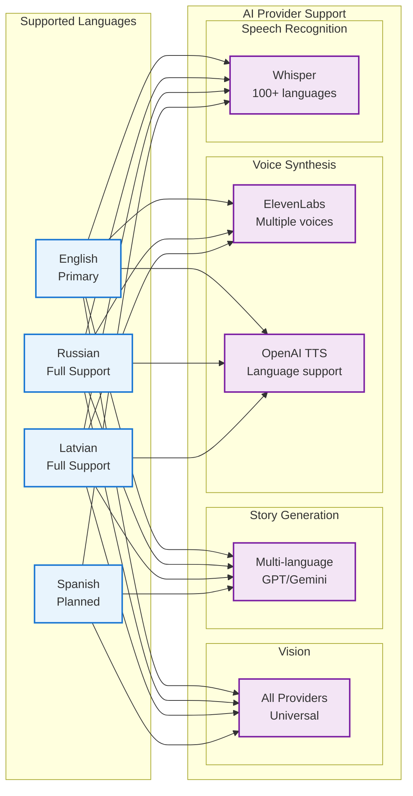

# Mira Storyteller - AI Pipeline Architecture

## 1. AI Agent Architecture Overview



## 2. Detailed Processing Pipeline

### 2.1 Image Processing Pipeline



### 2.2 Text Processing Pipeline



### 2.3 Audio Processing Pipeline



## 3. Agent Configuration System

```mermaid
graph LR
    subgraph "Configuration Management"
        YAML[agents.yaml<br/>Provider configs]
        ENV[Environment<br/>API Keys]
        RUNTIME[Runtime Config<br/>Dynamic selection]
    end

    subgraph "Agent Factories"
        VISION_F[Vision Factory<br/>create_vision_agent()]
        STORY_F[Story Factory<br/>create_storyteller_agent()]
        VOICE_F[Voice Factory<br/>create_voice_agent()]
        SPEECH_F[Speech Factory<br/>create_speech_agent()]
    end

    subgraph "Provider Selection"
        VISION_PROVIDER[Vision Provider<br/>openai/google]
        STORY_PROVIDER[Story Provider<br/>openai/google]
        VOICE_PROVIDER[Voice Provider<br/>elevenlabs/openai]
        SPEECH_PROVIDER[Speech Provider<br/>openai]
    end

    YAML --> VISION_F
    YAML --> STORY_F
    YAML --> VOICE_F
    YAML --> SPEECH_F

    ENV --> VISION_F
    ENV --> STORY_F
    ENV --> VOICE_F
    ENV --> SPEECH_F

    VISION_F --> VISION_PROVIDER
    STORY_F --> STORY_PROVIDER
    VOICE_F --> VOICE_PROVIDER
    SPEECH_F --> SPEECH_PROVIDER

    %% Styling
    classDef config fill:#E8F4FD,stroke:#1976D2,stroke-width:2px
    classDef factory fill:#FFF3E0,stroke:#F57C00,stroke-width:2px
    classDef provider fill:#F3E5F5,stroke:#7B1FA2,stroke-width:2px

    class YAML,ENV,RUNTIME config
    class VISION_F,STORY_F,VOICE_F,SPEECH_F factory
    class VISION_PROVIDER,STORY_PROVIDER,VOICE_PROVIDER,SPEECH_PROVIDER provider
```

## 4. Error Handling & Fallback Strategy



## 5. Cost Tracking & Analytics Integration



## 6. Language Support Matrix



## 7. Future AI Enhancements

### Planned AI Features
1. **Story Image Generation**: DALL-E 3 integration for story cover art
2. **Content Moderation**: AI-powered content filtering for safety
3. **Personalization**: ML-based story customization per child
4. **Interactive Elements**: Voice-controlled story navigation
5. **Multi-modal Stories**: Combined text, audio, and visual storytelling

### Performance Optimizations
1. **Response Caching**: Cache similar requests to reduce API calls
2. **Request Batching**: Combine multiple API calls where possible
3. **Smart Fallbacks**: Dynamic provider selection based on performance
4. **Edge Computing**: Move processing closer to users
5. **Model Fine-tuning**: Custom models for specific story types

This AI pipeline is designed to be modular, scalable, and cost-effective while maintaining high quality story generation across multiple languages and input modalities.