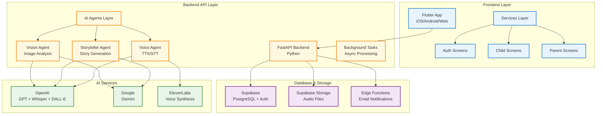
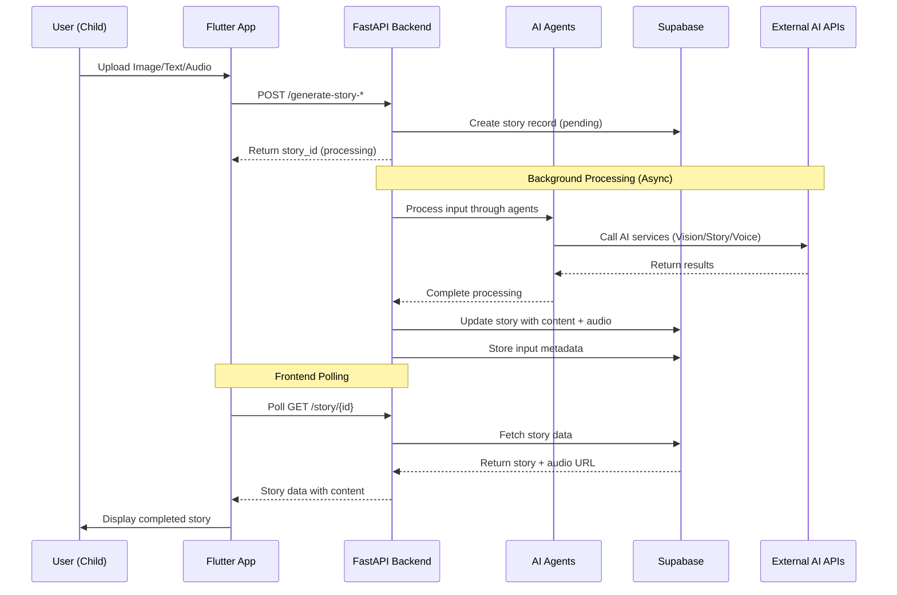
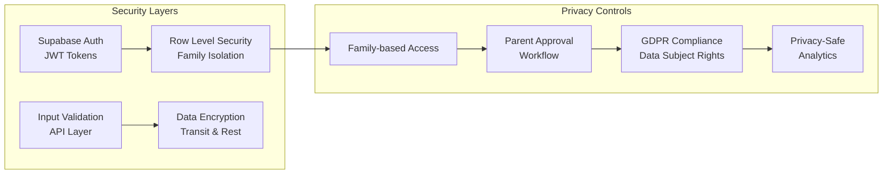
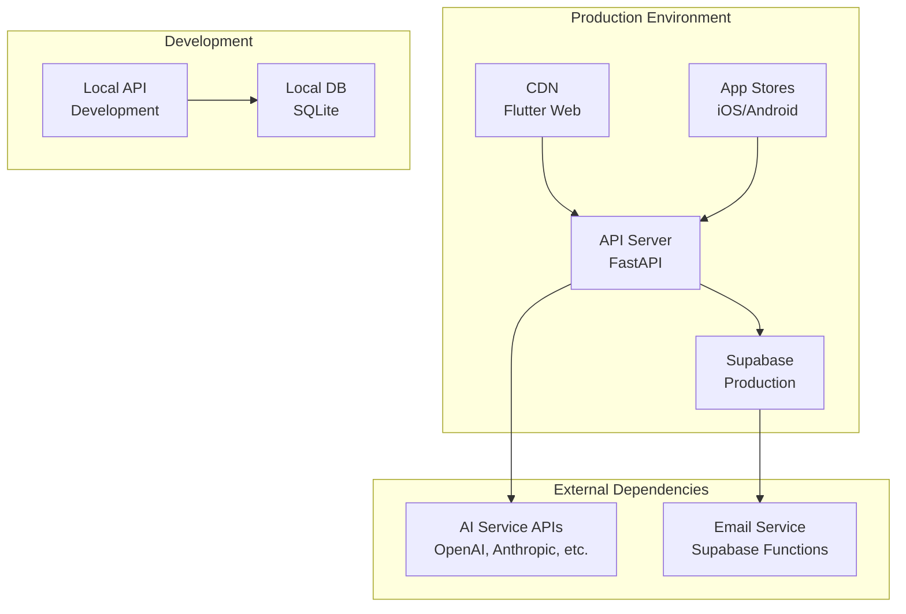

# Mira Storyteller - Project Architecture

## 1. System Architecture Overview



## 2. Technology Stack

### Frontend (Flutter)
- **Framework**: Flutter 3.x (iOS/Android/Web)
- **State Management**: Provider/Riverpod patterns
- **Authentication**: Supabase Auth integration
- **Localization**: i18n support (English, Russian, Latvian)
- **Platform Features**: Camera, microphone, biometrics

### Backend (FastAPI)
- **Framework**: FastAPI with Python 3.9+
- **Architecture**: Agent-based AI pipeline
- **Async Processing**: Background tasks for story generation
- **API Design**: RESTful with OpenAPI documentation
- **Middleware**: CORS, security, logging

### Database & Storage
- **Primary DB**: Supabase (PostgreSQL)
- **Authentication**: Supabase Auth with RLS
- **File Storage**: Supabase Storage for audio files
- **Edge Functions**: TypeScript for email notifications

### AI Services Integration
- **Vision**: OpenAI GPT-4V, Google Gemini Vision
- **Story Generation**: OpenAI GPT-4, Google Gemini Pro
- **Text-to-Speech**: ElevenLabs, OpenAI TTS
- **Speech-to-Text**: OpenAI Whisper

## 3. Data Flow Architecture



## 4. Security & Privacy Architecture



## 5. Deployment Architecture



## 6. File Structure Overview

```
uol-fp-mira/
├── app/                          # Flutter Frontend
│   ├── lib/
│   │   ├── screens/             # UI Screens
│   │   │   ├── auth/           # Authentication screens
│   │   │   ├── child/          # Child user interface
│   │   │   └── parent/         # Parent dashboard
│   │   ├── services/           # Business logic
│   │   ├── models/             # Data models
│   │   ├── widgets/            # Reusable components
│   │   └── constants/          # App configuration
│   └── assets/                 # Static resources
├── backend/                     # FastAPI Backend
│   ├── src/
│   │   ├── api/               # API routes & app factory
│   │   ├── agents/            # AI processing agents
│   │   ├── services/          # External service integrations
│   │   ├── core/              # Business logic
│   │   └── utils/             # Utilities & config
│   └── tests/                 # Test suite
├── supabase/                   # Database & functions
│   ├── migrations/            # DB schema changes
│   └── functions/             # Edge functions
└── docs/                       # Project documentation
```

## 7. Key Design Principles

1. **Family-Centric**: All data is organized around family units with proper isolation
2. **Multi-Language**: Built-in internationalization from the ground up
3. **Privacy-by-Design**: COPPA compliant with parental controls
4. **Agent-Based AI**: Modular AI processing with swappable providers
5. **Async Processing**: Non-blocking story generation with real-time updates
6. **Scalable Architecture**: Designed to handle growth with proper caching and optimization

## 8. Current Status & Next Steps

### Completed ✅
- Core story generation pipeline (image/text/audio inputs)
- Multi-language support framework
- Database schema with family-based RLS
- Basic Flutter UI with multiple input methods
- AI agent abstraction layer

### In Progress 🚧
- UI/UX improvements to match design mockups
- Authentication system integration
- Parent approval workflows
- Cost tracking and analytics

### Planned 📋
- Single AI provider migration for cost optimization
- Story image generation (DALL-E integration)
- Enhanced user behavior analytics
- Performance optimization and caching