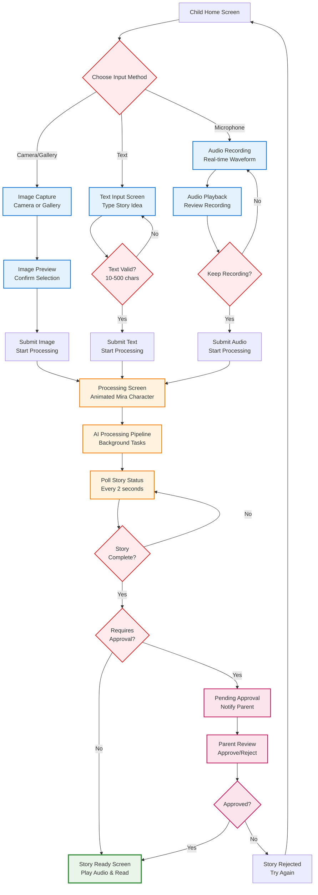
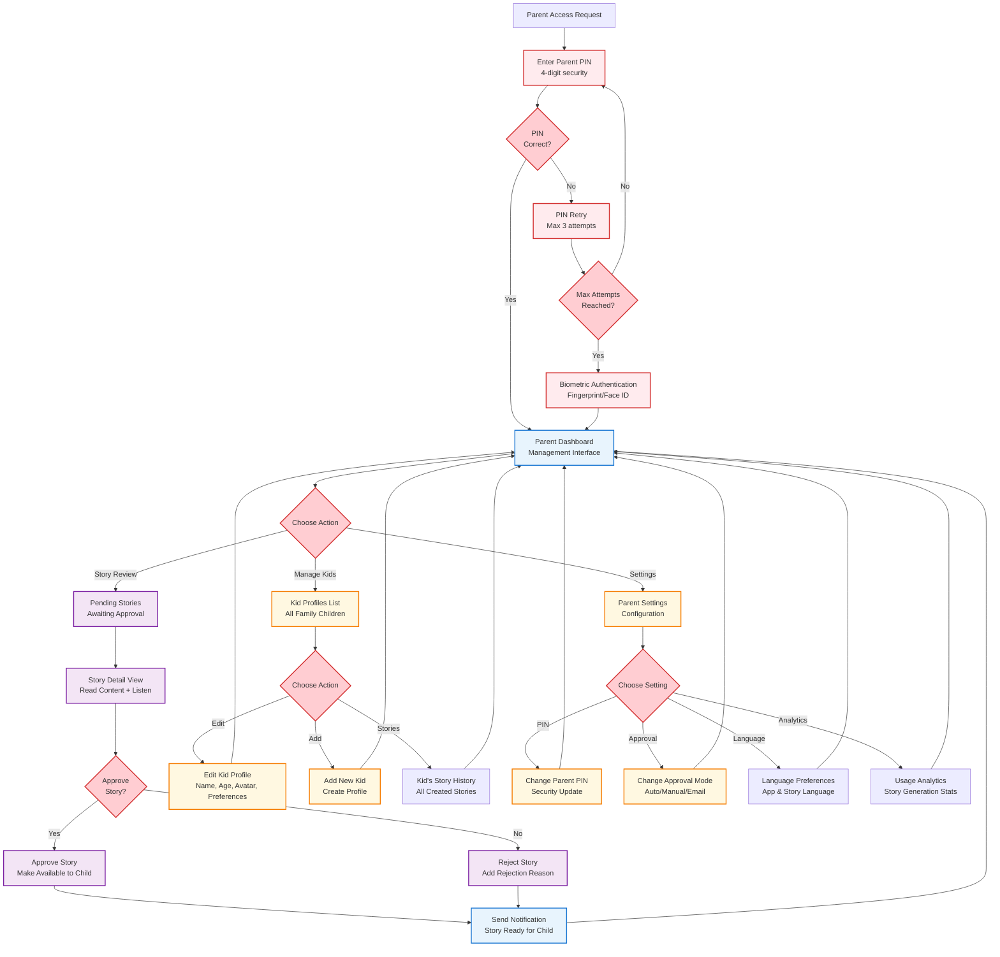
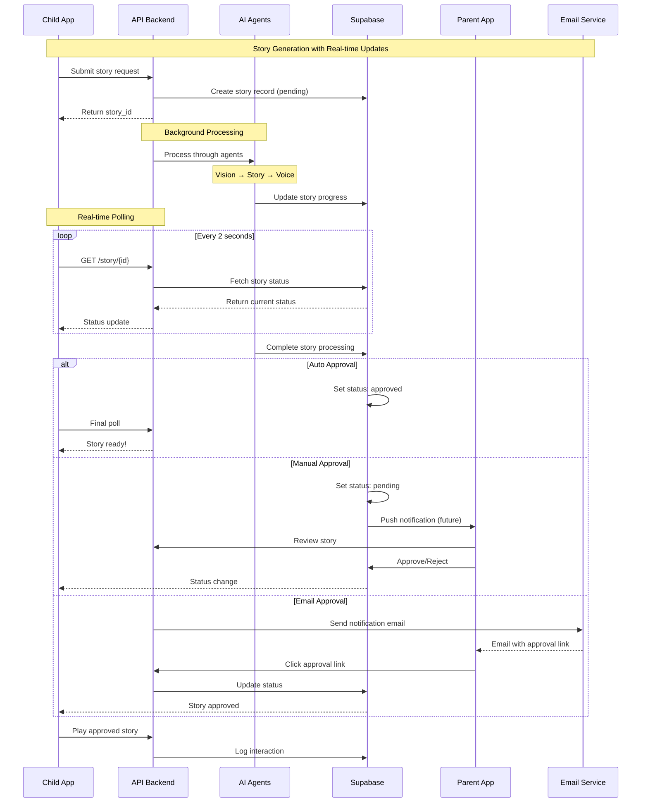

# Mira Storyteller - User Flow Diagrams

## 1. Authentication & Onboarding Flow

```mermaid
graph TD
    START([App Launch]) --> SPLASH[Splash Screen<br/>Mira Character Animation]
    SPLASH --> AUTH_CHECK{User<br/>Authenticated?}
    
    AUTH_CHECK -->|No| LOGIN[Login Screen<br/>Email/Phone + OTP]
    AUTH_CHECK -->|Yes| PROFILE_CHECK{Has Kid<br/>Profiles?}
    
    LOGIN --> OTP[OTP Verification<br/>Supabase Auth]
    OTP --> SUCCESS{OTP<br/>Valid?}
    SUCCESS -->|No| LOGIN
    SUCCESS -->|Yes| FIRST_TIME{First Time<br/>User?}
    
    FIRST_TIME -->|Yes| ONBOARDING[Welcome Onboarding<br/>App Introduction]
    FIRST_TIME -->|No| PROFILE_CHECK
    
    ONBOARDING --> CREATE_KID[Create First Kid Profile<br/>Name, Age, Avatar]
    CREATE_KID --> PIN_SETUP[Parent PIN Setup<br/>4-digit security PIN]
    PIN_SETUP --> APPROVAL_MODE[Choose Approval Mode<br/>Auto/Manual/Email]
    APPROVAL_MODE --> CHILD_HOME
    
    PROFILE_CHECK -->|No| CREATE_KID
    PROFILE_CHECK -->|Yes| SELECT_PROFILE[Profile Selection<br/>Choose Child Profile]
    SELECT_PROFILE --> CHILD_HOME[Child Home Screen<br/>Story Creation Interface]

    %% Styling
    classDef start fill:#E8F4FD,stroke:#1976D2,stroke-width:3px
    classDef auth fill:#FFF8E1,stroke:#F57C00,stroke-width:2px
    classDef profile fill:#F3E5F5,stroke:#7B1FA2,stroke-width:2px
    classDef decision fill:#FFEBEE,stroke:#D32F2F,stroke-width:2px
    classDef end fill:#E8F5E8,stroke:#388E3C,stroke-width:3px

    class START start
    class LOGIN,OTP,ONBOARDING auth
    class CREATE_KID,SELECT_PROFILE,PIN_SETUP,APPROVAL_MODE profile
    class AUTH_CHECK,SUCCESS,FIRST_TIME,PROFILE_CHECK decision
    class CHILD_HOME end
```

## 2. Story Creation Flow (Multiple Input Methods)



## 3. Parent Dashboard & Management Flow



## 4. Story Processing & AI Pipeline Flow

```mermaid
graph TD
    INPUT[User Input<br/>Image/Text/Audio] --> VALIDATE[Input Validation<br/>Size, Format, Content]
    VALIDATE --> VALID{Input<br/>Valid?}
    VALID -->|No| ERROR[Show Error<br/>Return to Input]
    VALID -->|Yes| CREATE_RECORD[Create Story Record<br/>Status: Pending]
    
    CREATE_RECORD --> BG_TASK[Start Background Task<br/>Async Processing]
    BG_TASK --> UPDATE_STATUS[Update Status<br/>Processing]
    
    %% AI Processing Pipeline
    UPDATE_STATUS --> DETERMINE_PATH{Input<br/>Type?}
    
    %% Image Path
    DETERMINE_PATH -->|Image| VISION_AGENT[Vision Agent<br/>Image Analysis]
    VISION_AGENT --> VISION_API[AI Vision API<br/>OpenAI/Google]
    VISION_API --> DESCRIPTION[Extract Description<br/>Scene, Characters, Objects]
    
    %% Text Path (Direct)
    DETERMINE_PATH -->|Text| DESCRIPTION
    
    %% Audio Path
    DETERMINE_PATH -->|Audio| SPEECH_TO_TEXT[Speech-to-Text<br/>OpenAI Whisper]
    SPEECH_TO_TEXT --> TRANSCRIPTION[Audio Transcription<br/>Convert to Text]
    TRANSCRIPTION --> DESCRIPTION
    
    %% Story Generation
    DESCRIPTION --> STORY_AGENT[Storyteller Agent<br/>Content Generation]
    STORY_AGENT --> STORY_API[Story Generation API<br/>LLM Providers]
    STORY_API --> STORY_CONTENT[Generated Story<br/>Title + Content]
    
    %% Voice Synthesis
    STORY_CONTENT --> VOICE_AGENT[Voice Agent<br/>Text-to-Speech]
    VOICE_AGENT --> TTS_API[TTS API<br/>ElevenLabs/OpenAI]
    TTS_API --> AUDIO_FILE[Generated Audio<br/>MP3 File]
    
    %% Storage & Completion
    AUDIO_FILE --> UPLOAD_AUDIO[Upload Audio<br/>Supabase Storage]
    UPLOAD_AUDIO --> UPDATE_RECORD[Update Story Record<br/>Content + Audio URL]
    UPDATE_RECORD --> CHECK_APPROVAL{Approval<br/>Required?}
    
    CHECK_APPROVAL -->|Auto| APPROVE_AUTO[Auto-Approve<br/>Status: Approved]
    CHECK_APPROVAL -->|Manual| PENDING_APPROVAL[Set Pending<br/>Notify Parent]
    CHECK_APPROVAL -->|Email| EMAIL_NOTIFY[Send Email<br/>Edge Function]
    
    APPROVE_AUTO --> COMPLETE[Story Complete<br/>Available to Child]
    PENDING_APPROVAL --> COMPLETE
    EMAIL_NOTIFY --> COMPLETE
    
    %% Error Handling
    VISION_API -.->|Error| HANDLE_ERROR[Handle Error<br/>Update Status: Error]
    STORY_API -.->|Error| HANDLE_ERROR
    TTS_API -.->|Error| HANDLE_ERROR
    HANDLE_ERROR --> ERROR_NOTIFY[Notify User<br/>Processing Failed]

    %% Styling
    classDef input fill:#E3F2FD,stroke:#1976D2,stroke-width:2px
    classDef validation fill:#FFF3E0,stroke:#F57C00,stroke-width:2px
    classDef ai fill:#F3E5F5,stroke:#7B1FA2,stroke-width:2px
    classDef storage fill:#E8F5E8,stroke:#388E3C,stroke-width:2px
    classDef decision fill:#FFEBEE,stroke:#D32F2F,stroke-width:2px
    classDef error fill:#FFCDD2,stroke:#F44336,stroke-width:2px

    class INPUT,DESCRIPTION,STORY_CONTENT,AUDIO_FILE input
    class VALIDATE,CREATE_RECORD,BG_TASK,UPDATE_STATUS validation
    class VISION_AGENT,VISION_API,STORY_AGENT,STORY_API,VOICE_AGENT,TTS_API,SPEECH_TO_TEXT ai
    class UPLOAD_AUDIO,UPDATE_RECORD,COMPLETE storage
    class VALID,DETERMINE_PATH,CHECK_APPROVAL decision
    class ERROR,HANDLE_ERROR,ERROR_NOTIFY error
```



## 5. Real-time Communication & Updates



## 6. Key User Experience Flows

### Child Experience Flow
1. **Simple Input**: Choose between camera, text, or microphone
2. **Visual Feedback**: Real-time waveforms, loading animations
3. **Immediate Engagement**: Processing screen with Mira character
4. **Story Consumption**: Audio playback with text display

### Parent Experience Flow
1. **Secure Access**: PIN + biometric authentication
2. **Review Control**: Approve/reject stories before child access
3. **Family Management**: Multiple child profiles, preferences
4. **Usage Insights**: Analytics and story history

### Privacy & Safety Flow
1. **Family Isolation**: RLS ensures family data separation
2. **Parental Controls**: Multiple approval modes (auto/manual/email)
3. **Content Moderation**: AI content filtering (future enhancement)
4. **Data Rights**: GDPR-compliant data management

This user flow design ensures a safe, engaging experience for children while providing parents with appropriate oversight and control mechanisms.